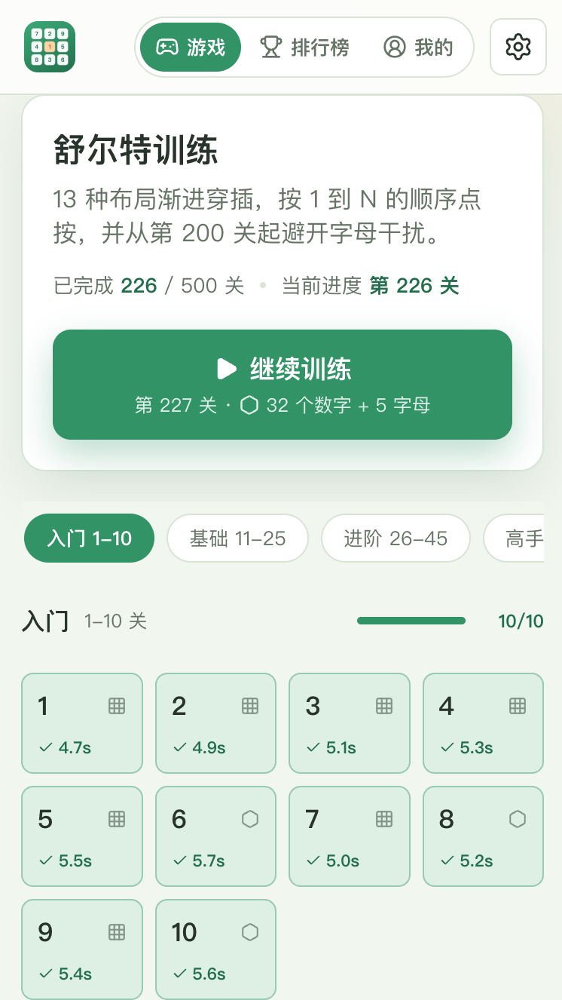
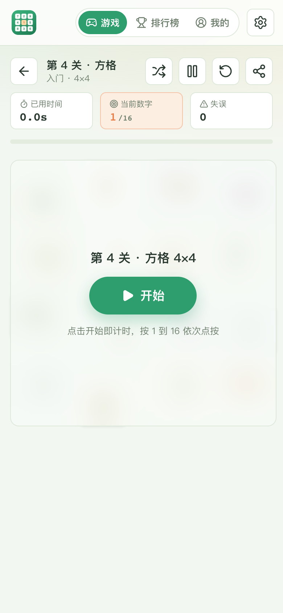
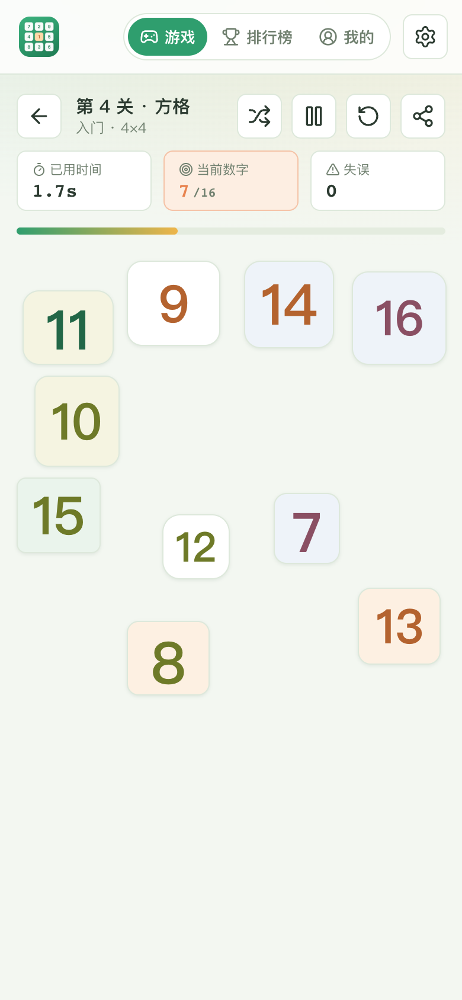
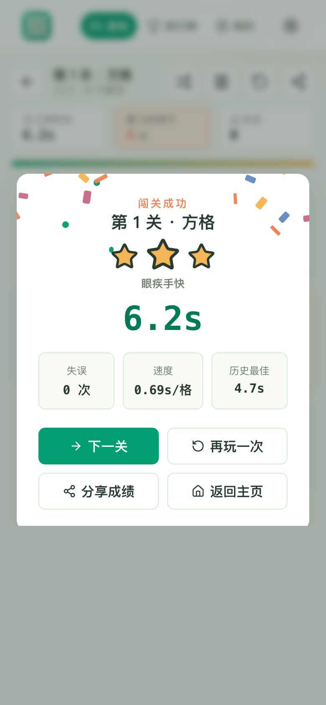
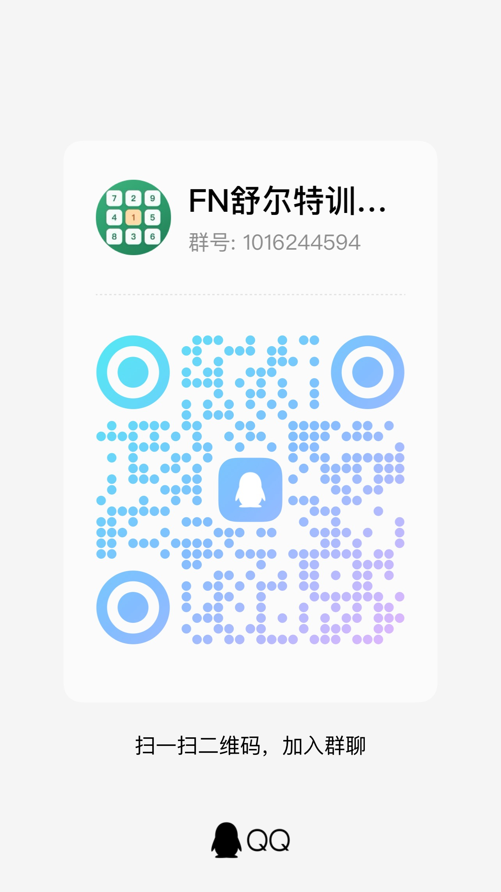

# 舒尔特训练

基于 fnOS App Template（Vue 3 + Nitro）的舒尔特注意力训练游戏，支持两种互不干扰的运行方式：

- fnOS `.fpk`：复用飞牛统一网关账号和 Unix Socket。
- Docker：使用独立本地账号、Cookie 会话和持久化 SQLite。

两种模式共享游戏功能和界面，但不共享登录会话、账号数据库或授权逻辑。

## Docker 快速开始

需要 Docker Engine 24+ 和 Compose v2：

```bash
docker compose pull
docker compose up -d
docker compose ps
```

访问 `http://服务器地址:3333/`。默认管理员为 `admin/admin`，首次登录后必须修改密码。账号和训练数据保存在 `schulte-data` 卷中。

指定主机目录：

```dotenv
SCHULTE_VERSION=1.0.7
SCHULTE_PORT=3333
DATA_HOST_PATH=/mnt/nas/schulte-data
```

默认 Docker 镜像为 `timorm/fnos-app-schulte`。如需使用镜像代理或自定义镜像，可在 `.env` 中设置 `DOCKERHUB_IMAGE`。

账号管理、忘记密码、备份、升级和回滚见 [Docker 部署文档](docs/DOCKER_DEPLOYMENT.md)。

## 功能概览

- 1-500 关渐进训练，包含方格、蜂巢、圆盘、波浪、扇形、椭圆轨道等 13 种布局。
- 101 关起限时挑战，200 关起加入字母干扰；支持重新排版和分享链接。
- 实时计时、失误提示、音效、触觉反馈、通关动画和本机离线记录。
- 家庭总榜、单关榜、个人训练档案和最近成绩。
- Docker 本地账号支持管理员新增、重置和删除普通账号，入口位于 `设置 → 账号管理`。
- fnOS 与 Docker 保持相同游戏 UI，仅认证方式不同。

## 界面截图

| 首页关卡 | 开始遮罩 | 方格对局 | 通关结算 |
| --- | --- | --- | --- |
|  |  |  |  |

## fnOS 安装与测试

```bash
npm ci
npm run pack:fpk
```

产物位于 `dist/fnos-app-schulte-<version>.fpk`，可从 fnOS 应用中心安装，或执行：

```bash
appcenter-cli install-fpk fnos-app-schulte-<version>.fpk
appcenter-cli start-fpk fnos-app-schulte
appcenter-cli list
```

fnOS 版本由网关提供登录态，不启用 Docker 本地账号页面。发布前请验证安装、升级、卸载数据策略，以及普通用户和管理员访问边界。

## 本地开发

环境要求：Node.js 22、npm；打包需要 `fnpack 1.2.3`。

```bash
npm ci
npm run dev
```

访问 `http://127.0.0.1:3333/app/fnos-app-schulte/`。更换端口：`APP_PORT=3340 WEB_PORT=3341 npm run dev`。

## 构建与验证

```bash
npm run build
npm run pack:app
npm run pack:fpk
npm test
GATEWAY_PREFIX=/ npm run build:web
docker compose config
git diff --check
```

元数据和网关前缀集中在 `template.config.json`，版本号以 `package.json` 为准。GitHub Actions 会并行构建 FPK 和 Docker，并在 Release 阶段统一发布。

## 目录与文档

```text
packages/ui/              Vue 前端与游戏逻辑
packages/server/          Nitro API、认证与数据服务
packages/assets/          fnOS 图标资源
scripts/                  开发、构建、打包和校验脚本
docs/                     部署、开发和设计文档
dist/                     FPK 发布产物
```

- [Docker 部署、账号和忘记密码](docs/DOCKER_DEPLOYMENT.md)
- [fnOS 开发与发布清单](docs/FNOS_DEVELOPMENT.md)
- [训练设计说明](docs/SCHULTE-DESIGN.md)
- [飞牛应用开发者平台](https://developer.fnnas.com/docs/guide/)

## 交流群

使用问题、功能建议和玩法反馈可以在 QQ 群讨论：1016244594。


