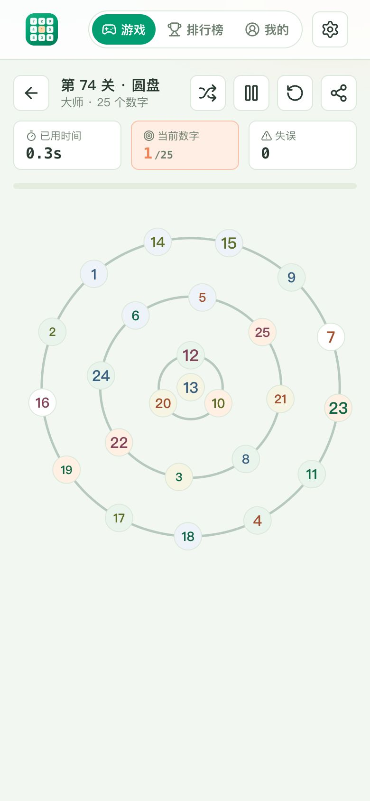
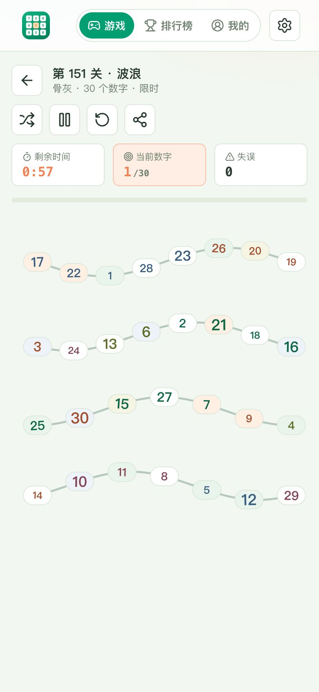
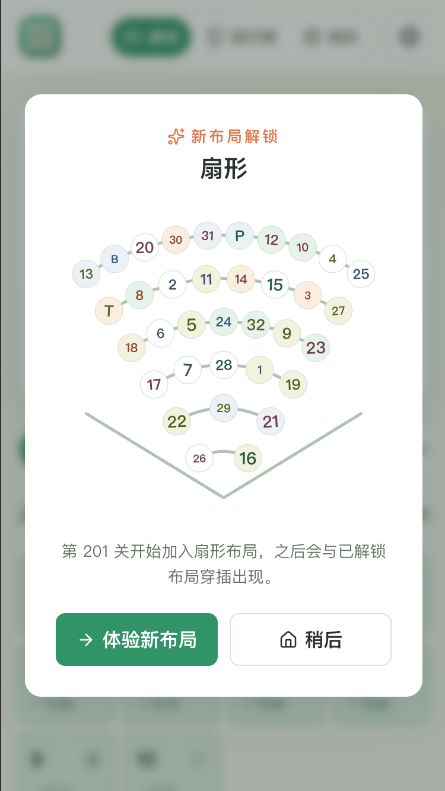
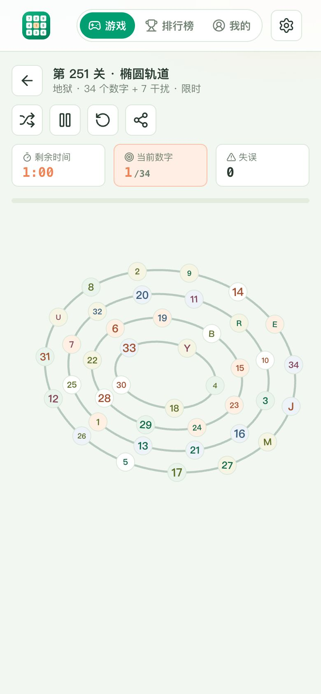
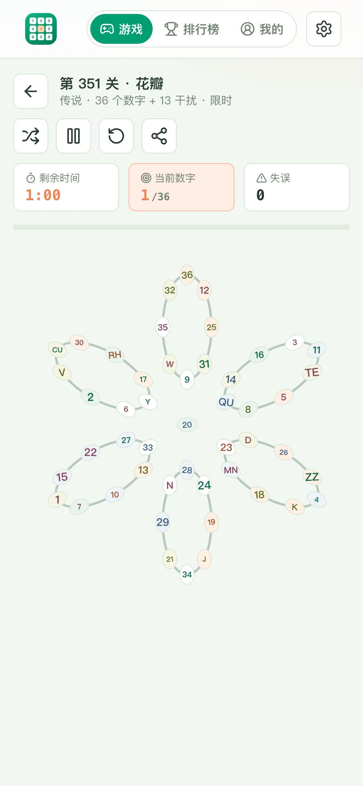
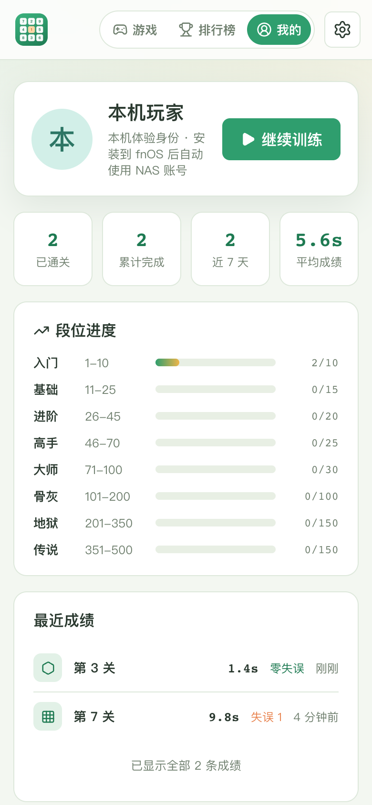

# 舒尔特训练

基于 fnOS App Template（Vue 3 + Nitro）构建的舒尔特注意力训练游戏，通过飞牛统一网关访问，复用 NAS 登录态。

仓库地址：[github.com/timor-m/fnos-app-schulte](https://github.com/timor-m/fnos-app-schulte)

## 玩法与功能

- 方格与蜂巢混合排布的 1-500 渐进关卡（3×3 到 10×10）；1-100 关全部开放，101 关起逐关通关解锁
- 101 关起为限时挑战：倒计时归零即失败，可重新挑战或换版重来
- 方格错落排布、蜂巢 SVG 无缝描边；格子淡色底与数字颜色/大小由种子随机组合，清新护眼
- 同一关的排布与配色默认固定（种子化生成），成绩可公平比较；游戏内可一键重新排版换出新局面
- 计时从首次点按开始，HUD 实时显示已用时间、当前数字/总数、失误与历史最佳
- 关卡分享链接直达：`/app/fnos-app-schulte/?level=12`，自定义局面带种子参数 `&s=…`
- 家庭排行榜：总榜（通关数 + 平均成绩）与单关榜（按最佳用时），领奖台式前三名展示
- 我的页面：段位进度、已通关/累计完成/近 7 天/平均成绩统计与最近成绩列表
- 用户身份直接复用飞牛统一网关（`X-Trim-*` 头），成绩按 NAS 用户存档到服务端 SQLite（`node:sqlite`），本机 localStorage 作为离线兜底
- 全面适配桌面与移动端

设计与运营建议（难度曲线、管理面板路线图、响应式策略）见 [docs/SCHULTE-DESIGN.md](docs/SCHULTE-DESIGN.md)。

## 界面截图（移动端）

| 首页关卡 | 开始遮罩 | 方格对局 | 蜂巢对局 |
| --- | --- | --- | --- |
|  |  |  |  |

| 圆盘布局 | 波浪布局 | 扇形布局 | 椭圆轨道 |
| --- | --- | --- | --- |
|  |  |  |  |

| 花瓣布局 | 通关结算 | 家庭排行榜 | 我的训练档案 |
| --- | --- | --- | --- |
|  |  |  |  |

## 环境要求

- Node.js 22
- npm
- 用于安装测试的 fnOS 设备
- `fnpack 1.2.3`，可通过项目命令下载
- 设备端 `appcenter-cli`，用于脚本化安装测试

## 快速开始

```bash
npm ci
npm run dev
```

本地访问：

```text
http://127.0.0.1:3333/app/fnos-app-schulte/
```

开发模式同时启动 Nitro 和 Vite。前端与 API 都使用网关前缀，尽早模拟安装后的路径行为。
端口被占用时可使用 `APP_PORT=3340 WEB_PORT=3341 npm run dev`。

## 配置

应用元数据集中在 `template.config.json`：

- `appName`：应用唯一标识
- `gatewayPrefix`：必须使用 `/app/{appName}` 或其子路径
- `gatewaySocket`：安装目录下的 Unix Socket 文件名
- `runtimeDependency`：默认 `nodejs_v22`
- `osMinVersion`：统一网关国内版最低要求，默认 `1.1.3100`
- `uiAllUsers`：桌面入口是否对所有用户可见
- `maintainer`、`distributor`：发布信息

版本号以 `package.json.version` 为准，打包时同步到 `manifest`。

## 构建与打包

```bash
npm run build
npm run pack:app
npm run download:fnpack
npm run pack:fpk
```

`pack:app` 会执行构建、生成 fnOS 包目录、创建 `app.tgz`，并校验：

- manifest 关键字段
- 网关入口与 Socket 配置
- 权限和资源声明
- 生命周期脚本及可执行权限
- 64px / 256px 包图标
- `app.tgz` checksum

构建产物：

- `dist/app.tgz`
- `dist/fnos-app-schulte-<version>.fpk`
- `.fnos-build/package/`，用于排查最终包内容

## 设备测试

手动测试可从应用中心选择 `.fpk` 安装。脚本化测试在 fnOS 设备执行：

```bash
appcenter-cli install-fpk fnos-app-schulte-<version>.fpk
appcenter-cli start fnos-app-schulte
appcenter-cli list
```

发布前应在干净设备上验证安装、启动、停止、升级、卸载保留/删除数据，以及普通用户和管理员的访问边界。

## 目录

```text
packages/ui/              Vue 前端
packages/server/          Nitro API、服务与网关用户工具
packages/assets/          fnOS 图标资源
scripts/                  开发、构建、打包与校验脚本
docs/FNOS_DEVELOPMENT.md  官方开发规范摘要与发布清单
.ui-dist/                 前端构建产物
.server-dist/             Nitro 构建产物
.fnos-build/package/      fnOS 包目录
dist/                     发布产物
```

## 交流群

使用问题、功能建议和玩法反馈都可以在 QQ 群里讨论，群号：1016244594。


## 官方资料

- [飞牛应用开发者平台](https://developer.fnnas.com/docs/guide/)
- [Native 应用案例](https://developer.fnnas.com/docs/examples/native/)
- [统一网关](https://developer.fnnas.com/docs/core-concepts/gateway-registration/)
- [fnpack](https://developer.fnnas.com/docs/cli/fnpack/)

仓库内的对照结论和维护清单见 [docs/FNOS_DEVELOPMENT.md](docs/FNOS_DEVELOPMENT.md)。
