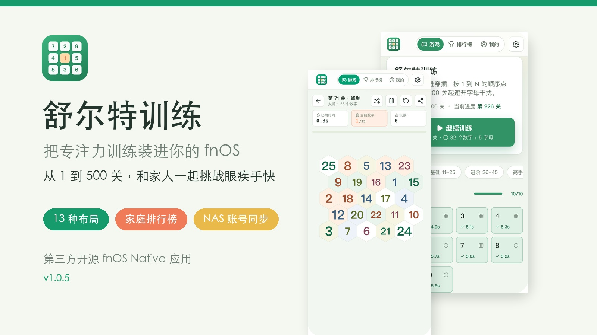

# 【开源应用】舒尔特训练：把 500 关专注力挑战装进 fnOS，全家都能比成绩

家里有 NAS，除了存照片、看电影，还能拿来练专注力吗？

我做了一款 fnOS Native 小应用「舒尔特训练」。打开以后，从数字 1 开始按顺序找到 N，越快完成越好。规则很简单，但真正玩起来很容易进入“再来一局”的状态，适合碎片时间练眼力、注意力和视觉搜索速度。

项目目前已开源，当前版本 **v1.0.6**。

## 它不只是常见的 5×5 方格

应用准备了 **1-500 关**的渐进训练：从 3×3 入门，逐步增加到 10×10。除了经典方格，还会穿插蜂巢、圆盘、波浪、扇形、轨道、花瓣等共 **13 种布局**，不会刚玩几关就觉得重复。

前 100 关适合熟悉节奏；101 关开始加入限时挑战；200 关以后还会出现字母干扰，需要从更复杂的画面中快速锁定下一个数字。难度是逐步增加的，新手可以从第 1 关慢慢来，熟练玩家也有足够长的挑战路线。

## 同一关，大家面对的是同一张题

每一关的数字位置、颜色和字号都由“关卡号 + 种子”确定。同一关默认会生成完全一致的局面，所以家人之间比成绩更公平，自己隔几天重玩也能直观看到有没有进步。

觉得已经记住布局？点一下“重新排版”就能换一套局面。新的种子会写进分享链接，发给家人后，对方打开的仍然是与你完全相同的题。

训练中会显示用时、当前数字、失误次数和历史最佳；支持暂停、重开、换版和分享。点错时只做清晰反馈，不会让一次误触毁掉整局。

## fnOS 账号直接变成家庭训练档案

这是我最想做成 fnOS 应用的原因：它直接复用飞牛统一网关的登录状态，不需要一家人再分别注册新账号。

- 每位 NAS 用户的成绩独立保存
- 家庭总榜按通关数和平均成绩排名
- 单关榜按最佳用时排名，可直接去挑战
- “我的”页面展示段位进度、累计完成、近 7 天训练和最近成绩
- 成绩保存到 NAS 本地 SQLite；浏览器本地记录可作为离线兜底

全家用同一台 NAS，却各有各的进度和成绩。谁刷新了单关纪录，打开排行榜就能看到。

## 桌面和手机都能玩

界面针对桌面和移动端都做了适配。手机触控目标、棋盘尺寸、横竖屏空间都经过调整；如果系统开启了“减少动态效果”，应用也会自动降低动画。

应用完全运行在自己的 NAS 上，没有广告，也不需要外部云服务。源码采用 MIT License，前端是 Vue 3，后端是 Nitro + SQLite。

## 安装方式

1. 前往应用中心或项目 Releases 页面下载最新的 `.fpk` 安装包。
2. 打开 fnOS 应用中心，选择手动安装。
3. 安装完成后，从桌面打开「舒尔特训练」即可。

环境要求：**fnOS 1.1.3100 或更高版本**；支持 fnOS 可用平台。

- 项目地址：<https://github.com/timor-m/fnos-app-schulte>
- 安装包下载：<https://github.com/timor-m/fnos-app-schulte/releases>
- 当前版本：v1.0.6

这是一个第三方开源应用。如果遇到安装、显示或成绩记录问题，欢迎在帖子里反馈，最好附上 fnOS 版本、设备型号和问题截图，方便定位。

也欢迎来晒一下：你在经典 5×5 方格上，最快能跑到多少秒？

---

建议标签：`第三方应用` `开源` `效率工具` `亲子` `小游戏` `舒尔特训练`

<!--
发帖提示：先上传 docs/forum-assets 下的 3 张 JPG，再将正文中的相对图片路径替换为论坛返回的图片地址。
-->
